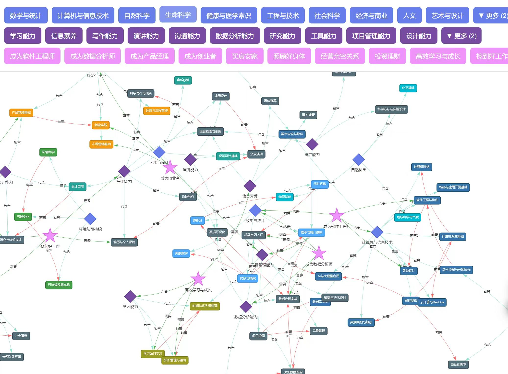
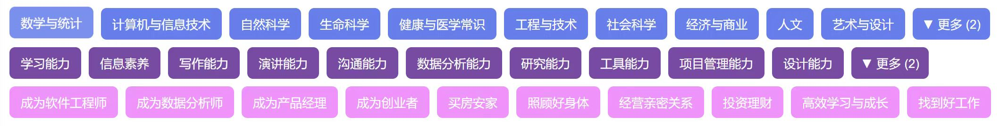
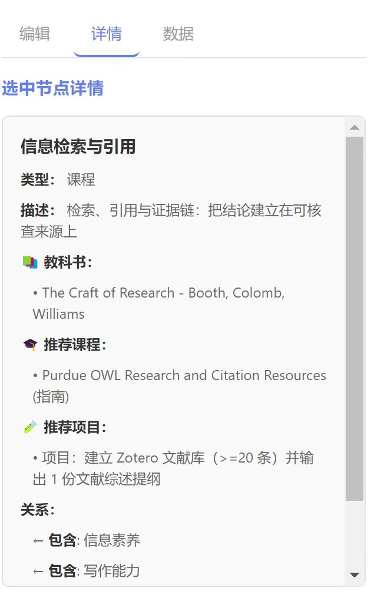
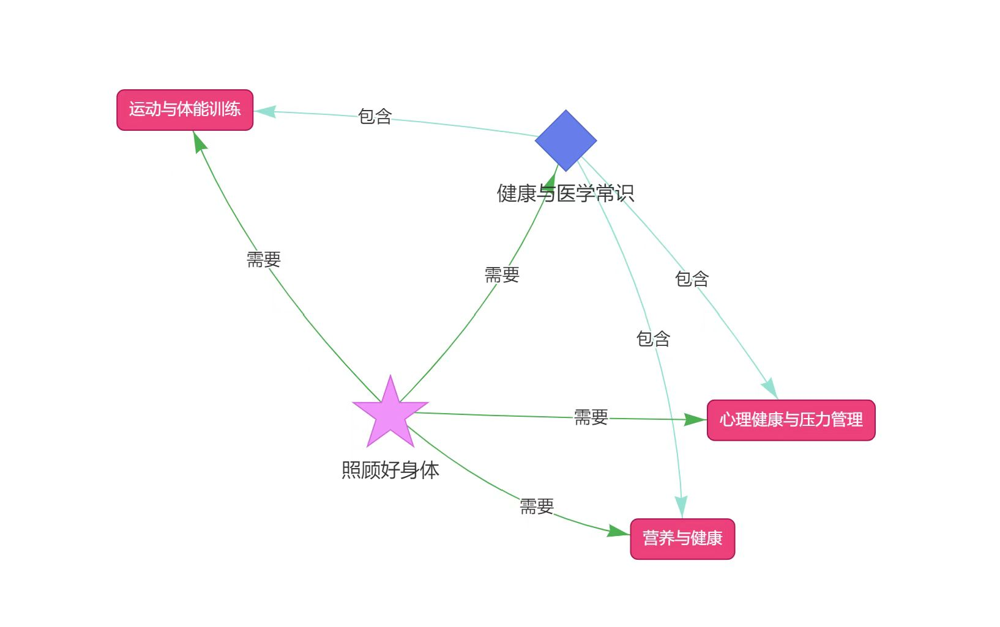
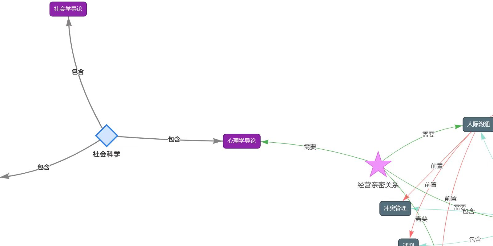

## 人生目标驱动的知识地图——AI时代的个人学习新范式
借助AI大模型，我们可以学习比以前多的多的知识。但是如何学习呢？
传统的学习路径为: 选择一个专业 -》在学校参加各种课程学习该专业 -》毕业后根据这个专业找一份工作/毕业后发现远远不够、不合适、浪费了大量时间，但是年纪大了似乎已为时已晚。

AI带来了知识平权，AI比任何一个老师都更专业， 新时代的学习路径该是怎样的？
在传统教育体系中，学习路径往往是由制度决定的：  
先选一个专业，再上对应的课程，最后进入某个行业。
但在AI时代，当知识获取不再受学校和老师限制时，我们就要面对一个本质的问题：
我到底想成为什么样的人？
学习不再只是为了完成一套课程体系，而是为了实现某种人生目标。  
因此，新的学习路径应该从“人”出发，而不是从“专业”出发。学习路径的终点是帮助每个人成为最好的自己。

AI时代的学习路径为：目标是成为最好的自己 -》要成为最好的自己需要解决什么问题/达成什么目标 -》需要什么哪些课程/能力/专业知识来支持 -》去掌握这些相应的知识/能力

根据上述原则，我借ai简单实现了一个在线知识地图，尝试刻画AI时代的学习地图，希望给大家一点启发。我将要学习的知识抽象为概念和课程两大类。概念是抽象的知识集合，课程是具体要学习的知识单元。
概念分为三类：

- 学科（图中的第一行蓝色部分). 顾名思义，学科是我们在大学期间学习的专业，比如图中的计算机，数学统计等
- 能力（图中的第二行紫色部分). 能力更多的代表一些通用的综合能力，比如沟通能力，表达能力等。学历高不代表能力高
- 问题/目标（图中的第三行粉色部分). 用于定义我们在这个社会生存需要解决什么问题，成为什么样的人。比如大家要买房，找对象，要获得某种职业等。

课程是基本的知识单元，比如我们在大学学习的课程或者一些实践单元。课程之间有前置关系。利用ai大模型可以很方便的收集到互联网上的顶级课程资源。

通过这样的知识地图，可以很方便帮助用户：
- 了解到要解决怎样的问题/实现怎样的人生目标 需要学习哪些课程，具备哪些能力。通过问题/目标去学习课程，减少了走弯路、学而无用等问题。

- 也可以从底层出发，了解到学习了该课程可以有哪些好处，可以掌握哪些能力，解决什么人生问题。

- 自由探索课程、能力、人生问题、知识之间的关联关系

知识地图在线访问地址：https://lifeng6666666.github.io/knowledge-map/

另外本地图具备基本常用的数据，还支持用户自行添加和编辑人生问题、能力与课程节点，让这张地图不断演化、完善。